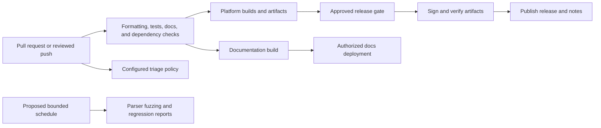

# Proposed automation roles

## Status and authority

These nine roles preserve the original repository design. They are responsibilities for future tooling, not running Codex agents or installed workflows. No triggers, schedules, publishing jobs, issue bots, credentials, or permissions are configured.

Role descriptions do not authorize commits, pushes, releases, deployments, or external messages. Configure automation deliberately with scoped permissions, reviewed triggers, and documented failure handling. Use maintained tooling compatible with actual manifests instead of treating the original suggested action names as requirements.

## Intended workflow

Passing ordinary CI does not itself publish a release. See [releases](releases.md), [security](security.md), and [testing](../development/testing.md).

## Development Agent

- **Purpose:** Code quality and fast local iteration.
- **Inputs and proposed triggers:** Source changes, future manifests, and lint configuration; proposed triggers are main-branch pushes, pull requests, and manual dispatch.
- **Outputs:** Formatting and lint reports plus documented development prerequisites.
- **Implementation and permissions:** Use manifest-backed Rust formatting and Clippy checks and the chosen frontend checks. Read access is sufficient for CI; formatting fixes should be separate reviewed changes.
- **Failure handling:** Report formatting or lint failures with their scope and reproduction steps; do not silently rewrite a contributor's patch.
- **Metrics:** Formatting violations, lint failures, and feedback duration.

## CI/CD Agent

- **Purpose:** Cross-platform build and artifact preparation.
- **Inputs and proposed triggers:** Reviewed source, build configuration, and scoped signing credentials; proposed triggers are main pushes, version tags, manual builds, and optional nightly builds.
- **Outputs:** Web bundle, native binaries, installers, checksums, and build/signing results.
- **Implementation and permissions:** Use Windows, Linux, and macOS jobs with repository-defined Tauri commands. Ordinary jobs need read access and artifact upload permissions; signing and release writes belong to separately authorized trusted jobs.
- **Failure handling:** Identify missing native dependencies, build errors, and expired signing credentials. Keep failed artifacts from being promoted to a release.
- **Metrics:** Build success and duration per platform; signing verification success.

## Testing Agent

- **Purpose:** Behavioral verification and parser robustness.
- **Inputs and proposed triggers:** Future tests, local emulators, and sanitized corpora; proposed triggers are PR changes and a bounded nightly fuzzing schedule.
- **Outputs:** Test results, coverage where configured, and minimized reproducible fuzz failures.
- **Implementation and permissions:** Use configured Rust/frontend tests and a selected fuzzing tool, with cargo-fuzz or honggfuzz as candidates. Permit local emulation; do not require public MUD access or publishing permissions.
- **Failure handling:** Reproduce failures, minimize crashes or hangs, repair the behavior, and retain a sanitized regression case without weakening tests.
- **Metrics:** Failing tests, measured coverage, unique reproducible fuzz findings, and time to reproduce.

## Release Agent

- **Purpose:** Versioning, release notes, and controlled publication.
- **Inputs and proposed triggers:** An approved release commit, verified artifacts, compatibility changes, and history; proposed triggers are explicit release dispatch or an approved version tag.
- **Outputs:** Consistent version metadata, changelog entries, release notes, tags, and GitHub release assets when authorized.
- **Implementation and permissions:** Use semantic versioning once a public contract exists. Conventional commit history may support a release helper or notes drafter. Restrict tag and release writes to the release workflow; follow the release gates.
- **Failure handling:** Stop for version mismatch, wrong commit, missing validation, incomplete assets, or incorrect notes. Repair the draft before publication and do not overwrite released assets silently.
- **Metrics:** Release frequency, lead time, completeness, and failed publication attempts.

## Documentation Agent

- **Purpose:** Maintained developer/user guidance and future generated API documentation.
- **Inputs and proposed triggers:** Source comments, design changes, plugin contracts, and examples; proposed triggers are documentation/source changes and releases.
- **Outputs:** Reviewed Markdown, future Rustdoc output, user guides, and validated example documentation.
- **Implementation and permissions:** Use cargo doc only after manifests exist. Choose a static documentation generator when needed; MkDocs or mdBook are options. Separate read-only docs checks from a narrowly privileged Pages deployment.
- **Failure handling:** Fail on broken links, unsupported claims, outdated examples, or generation failures; fix source documentation before deployment.
- **Metrics:** Link failures, documented public API coverage when measurable, and docs build/deploy results.

## Security/Dependency Agent

- **Purpose:** Dependency advisory and license review.
- **Inputs and proposed triggers:** Future dependency manifests and lockfiles, license policy, and advisory data; proposed triggers are dependency changes and periodic scheduled review.
- **Outputs:** Advisory, license, dependency-source, and duplicate-version reports with triage decisions.
- **Implementation and permissions:** Consider cargo audit/RustSec and cargo deny after dependencies exist; also cover the chosen frontend ecosystem. Scanning needs read access and advisory access. Issue or advisory publication needs separately authorized write access.
- **Failure handling:** Assess applicability, update or replace affected dependencies, and record justified, bounded exceptions. Do not equate a clean advisory scan with a secure application.
- **Metrics:** Open applicable advisories, remediation time, license-policy violations, and exception age.

## Plugin Ecosystem Agent

- **Purpose:** Compatible, documented plugin examples and future templates.
- **Inputs and proposed triggers:** Host interface changes, runtime examples, and plugin submissions; proposed triggers are plugin-related PRs and releases.
- **Outputs:** Validated examples, compatibility documentation, and optionally generated templates or a catalog.
- **Implementation and permissions:** Establish a versioned host contract before generating templates. Build implemented native/WASM examples and validate selected scripting examples with scoped capabilities. Use read-only checks unless a reviewed update is authorized.
- **Failure handling:** Reject incompatible artifacts, update examples alongside contract changes, and document required migrations. Do not pretend an undeclared native ABI is stable.
- **Metrics:** Example validation rate, compatibility regressions, plugin-author issues, and known community adoption.

## Contributor/Triage Agent

- **Purpose:** Actionable issues and timely review.
- **Inputs and proposed triggers:** Issue and PR metadata, templates, and label rules; proposed triggers are submissions, updates, and a separately configured inactivity schedule.
- **Outputs:** Suggested or authorized labels, review routing, and contributor guidance.
- **Implementation and permissions:** Start with the Markdown templates. Add minimal issue/PR permissions only when enabling triage. Any welcome messages, stale reminders, or automated closures need an explicitly configured policy and authorization.
- **Failure handling:** Correct mislabeling, missed reviews, and false stale classifications. Do not expose sensitive reports through automated public comments.
- **Metrics:** Time to first response, review latency, backlog age, and corrected classifications.

## Developer UX Agent

- **Purpose:** Repeatable local setup and efficient feedback.
- **Inputs and proposed triggers:** Future container configuration, toolchain choices, and developer feedback; proposed triggers are environment changes or manual checks.
- **Outputs:** Verified setup documentation, future environment checks, and optional container images.
- **Implementation and permissions:** Document exact prerequisites and manifest-backed development commands. Evaluate hot reload after application setup. Keep container mounts narrow and dependency installation explicit.
- **Failure handling:** Reproduce clean-environment failures, diagnose platform differences and slow reloads, then update configuration and docs together.
- **Metrics:** Time to first successful run, rebuild/reload duration, and environment-related issues.

## Enabling a role later

Add configuration only as part of an implementation task. Document the actual trigger, exact commands, permission scope, artifact retention, and failure owner. Validate the workflow on the relevant platform and distinguish dry-run evidence from production publication. The [primary references](../../resources/references/README.md) cover the proposed tooling.
